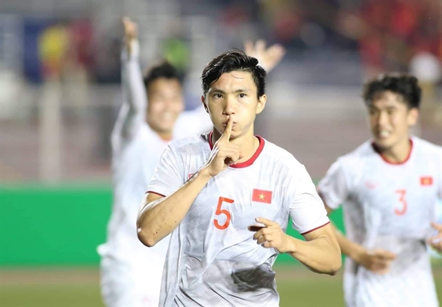
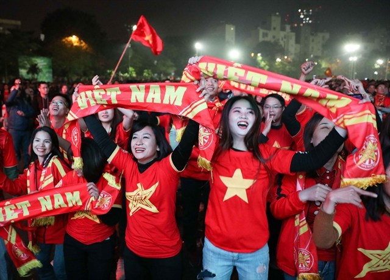
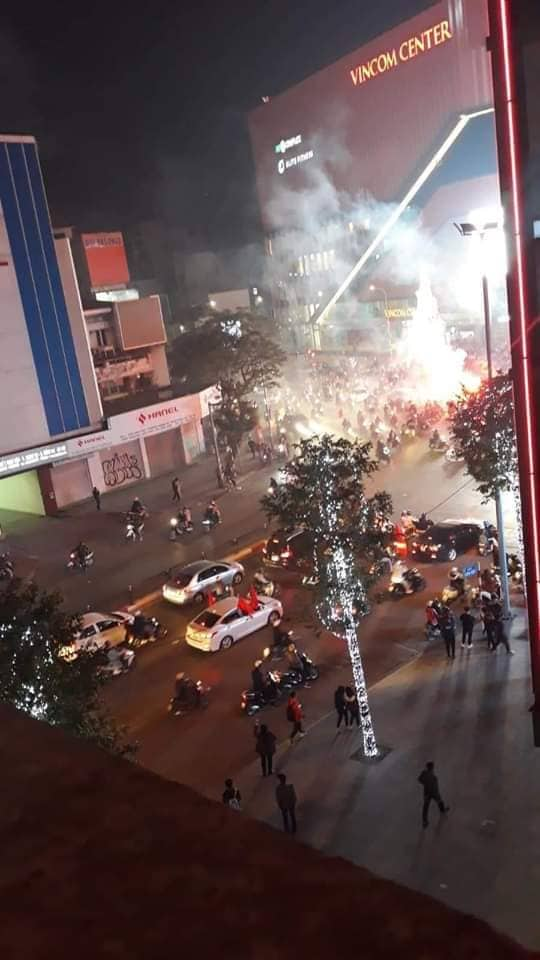

The dreams of millions of Vietnamese football fans came true after decades of hurt and false dawns tonight, as the men's team won their first ever gold medal at the Southeast Asian Games.

The U22 team made history by thrashing Indonesia 3-0 in the final at the Rizal Memorial Stadium in Manila, the Philippines.

What a night for Vietnamese people, there is a great festival atmosphere everywhere in Vietnam.

6 hours later, Chelsea faced Lille in a must-win match. Fortunately, everything is fine with 2 - 1 as final result.

## References:
* https://vietnamnews.vn/sports/569668/historic-win-for-viet-nam-in-sea-games-football.html#f4RKmU2t7hFVDmmZ.97

* https://www.thestatesman.com/sports/chelsea-vs-lille-lampards-londoners-survive-nervy-final-minutes-to-step-into-knockouts-1502832230.html
